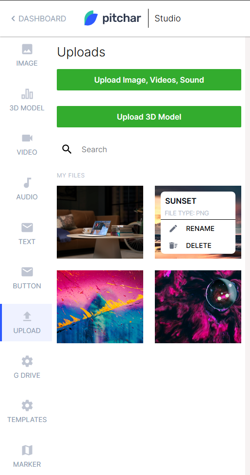

React implementation of the wireframe provided
Solution uses a stack of:
1. React w/ Hooks
2. TypeScript
3. SCSS
4. Webpack

Implements the `Upload` part of the wireframe posted.
The search works for the files as well.

## Screenshots

